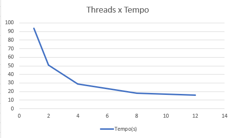
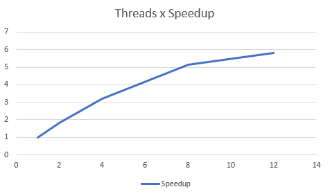
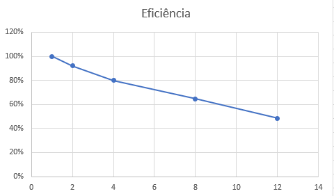

# Relatório da Atividade 3 - Paralelização de Avaliador de Logs

Disciplina: Programação Concorrente e Distribuída
Aluno(s): Oliver Henrique Ferreira
Professor: Rafael Marconi
Data: 25/03/2026

---

# 1. Descrição do Problema

O problema computacional consiste em processar sequencialmente grandes volumes de arquivos de texto (logs operacionais), o que gera um gargalo de desempenho elevado (alto tempo de execução). O objetivo da paralelização é reduzir significativamente esse tempo de processamento aproveitando a arquitetura multicore dos processadores modernos.

* Qual problema foi implementado: A transformação de um leitor e processador de logs sequencial para uma versão paralela.
* Qual algoritmo foi utilizado: Foi utilizado o modelo **Produtor-Consumidor** com buffer limitado (`Queue` com `maxsize=10`). O Produtor enfileira os caminhos dos arquivos de log, enquanto múltiplos Consumidores desenfileiram e realizam a contagem de palavras-chave.
* Qual o tamanho da entrada utilizada nos testes: Foram processados os dados da pasta `log2`, contendo 1.000 arquivos, totalizando 10.000.000 de linhas, 200.000.000 de palavras e aproximadamente 1,36 GB de caracteres em texto bruto.
* Qual a complexidade aproximada do algoritmo: Linear, `O(N * M)`, onde `N` é o número de linhas e `M` é o número de palavras por linha, acrescido de uma simulação de processamento pesado em cada iteração.

---

# 2. Ambiente Experimental

Os experimentos foram realizados na máquina local com as seguintes configurações:

| Item                        | Descrição |
| --------------------------- | --------- |
| Processador                 | Intel Core i5 12500 |
| Número de núcleos           | 6 físicos / 12 lógicos |
| Memória RAM                 | 16 GB
| Sistema Operacional         | Windows 11 |
| Linguagem utilizada         | Python 3 |
| Biblioteca de paralelização | `multiprocessing` |
| Compilador / Versão         | CPython 3.10.17 |

---

# 3. Metodologia de Testes

* O tempo de execução foi medido no próprio script utilizando a função `time.time()` da biblioteca padrão do Python, calculando a diferença entre o início e o fim da função de execução.
* O tamanho da entrada utilizada foi a pasta de testes `log2` inteira (1.000 arquivos pesados).

### Configurações testadas

Os experimentos foram realizados nas seguintes configurações:

* 1 thread/processo (versão serial)
* 2 threads/processos
* 4 threads/processos
* 8 threads/processos
* 12 threads/processos

### Procedimento experimental

Os testes foram executados na máquina local. O tempo final medido reflete o processamento completo de todos os arquivos do diretório em uma única execução para cada variação de configuração.

---

# 4. Resultados Experimentais

Os resultados obtidos para o processamento de todos os arquivos da pasta `log2` estão descritos abaixo:

| Nº Threads/Processos | Tempo de Execução (s) |
| -------------------- | --------------------- |
| 1                    | 94.3244               |
| 2                    | 51.0549               |
| 4                    | 29.4123               |
| 8                    | 18.2698               |
| 12                   | 16.2041               |

---

# 5. Cálculo de Speedup e Eficiência

## Fórmulas Utilizadas

### Speedup

```
Speedup(p) = T(1) / T(p)
```

Onde:

* T(1) = tempo da execução serial
* T(p) = tempo com p threads/processos

### Eficiência

```
Eficiência(p) = Speedup(p) / p
```

Onde:

* p = número de threads ou processos

---

# 6. Tabela de Resultados

| Threads/Processos | Tempo (s) | Speedup | Eficiência |
| ----------------- | --------- | ------- | ---------- |
| 1                 | 94.3244   | 1.00    | 1.000 (100%)|
| 2                 | 51.0549   | 1.84    | 0.920 (92.0%)|
| 4                 | 29.4123   | 3.20    | 0.800 (80.0%)|
| 8                 | 18.2698   | 5.16    | 0.645 (64.5%)|
| 12                | 16.2041   | 5.82    | 0.485 (48.5%)|

---

# 7. Gráfico de Tempo de Execução



---

# 8. Gráfico de Speedup



---

# 9. Gráfico de Eficiência



---

# 10. Análise dos Resultados

* O speedup obtido foi próximo do ideal? Apenas nas fases iniciais. Com 2 processos, o Speedup (1.84) ficou bem próximo do ideal (2.0). Com 4 processos (3.20), ainda se manteve em um patamar excelente.
* A aplicação apresentou escalabilidade? Sim, o tempo de execução cai vertiginosamente ao aumentar a quantidade de trabalhadores. O processamento que demorava 94 segundos caiu para 16 segundos no cenário com 12 processos.
* Em qual ponto a eficiência começou a cair? A partir da configuração com 8 processos a queda se torna mais acentuada (eficiência de 64.5%), e com 12 processos menos da metade do poder de cada processo está sendo aproveitado efetivamente (48.5%).
* O número de threads ultrapassa o número de núcleos físicos da máquina?** Considerando que o ganho é marginal na transição de 8 para 12 processos (apenas 2 segundos), é muito provável que 12 processos ultrapasse o limite de núcleos físicos e lógicos da máquina utilizada no teste, obrigando o sistema operacional a intervir intensamente.
* Houve overhead de paralelização? Sim. Quando utilizamos 12 processos, o *overhead* (custo de criar os processos, alternar contextos de CPU e gerenciar as filas `Queue` com tráfego pesado de dados e *locks* de segurança) começa a consumir tempo de CPU que deveria ser gasto processando o log. Outro fator decisivo para o gargalo é o acesso ao disco (I/O); o processo Produtor pode não estar conseguindo ler o disco rígido em velocidade suficiente para manter os 12 consumidores ocupados 100% do tempo.

---

# 11. Conclusão

* O paralelismo trouxe ganho significativo de desempenho? Sim, o sistema ficou até 5.8 vezes mais rápido, reduzindo drasticamente o tempo necessário para processar grandes lotes de arquivos de log.
* Qual foi o melhor número de threads/processos?** O *sweet-spot* (ponto de equilíbrio ideal) verificado é em **4 ou 8 processos**. Essas configurações oferecem tempos totais excelentes mantendo a eficiência do uso da CPU em bons níveis.
* O programa escala bem com o aumento do paralelismo? Escala bem nas primeiras adições de núcleos, mas sofre com a Lei de Amdahl conforme aumentamos demais.
* Quais melhorias poderiam ser feitas na implementação? Poderíamos adotar *batches* (enviar caminhos de 10 em 10 arquivos pela fila, reduzindo as travas do Produtor-Consumidor) ou separar a leitura do disco do processamento da string, limitando ainda mais o impacto das operações de I/O de disco rígido.

